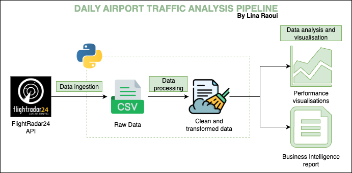
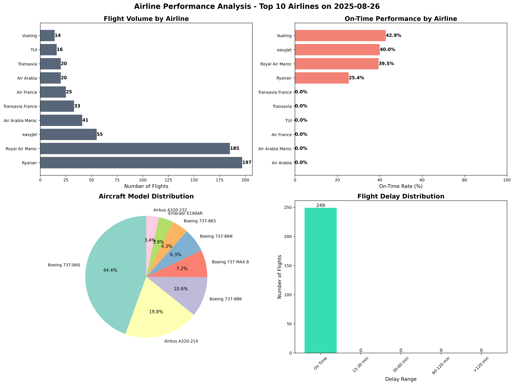
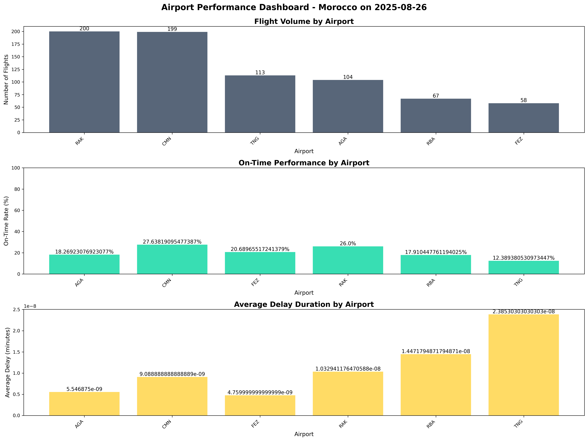

# 🛫 Daily Moroccan Airport Traffic Analysis
## Project Overview

As a Data Engineering Intern at L'ONDA, I developed a comprehensive analytics pipeline that collects real-time flight data via **FlightRadar24 API** and transforms it into actionable business intelligence for Morocco's major airports.

### Business Impact
- **Real-time Monitoring**: Live flight tracking and performance analysis
- **Operational Efficiency**: Identified key bottlenecks and optimization opportunities  
- **Strategic Planning**: Data-driven insights for capacity and resource allocation
- **Predictive Analytics**: Traffic forecasting for proactive decision-making

### Technical Stack   
[](#)
[](#)
[](#)

### Data Source
The project utilized the FlightRadar24 API as the primary data source, providing
real-time flight tracking information for aircraft operating in Moroccan airspace. Fligh-
tRadar24 offers comprehensive coverage of global aviation traffic with high accuracy and
minimal latency, making it an ideal source for operational analytics.
<p align="center">
  
</p>

## Key Features & Outputs

### **Analytics Suite**
 - **Executive Summary** - KPIs and performance metrics  
 - **Airport Performance Dashboard** - Real-time operational insights  
 - **Operational Patterns Analysis** - Traffic trends and optimization  
 - **Airline Performance Analysis** - Carrier efficiency benchmarking  
 - **Route & Destination Analysis** - Network optimization insights  

### **Sample Results**
```
Total Flights Analyzed: 674
On-Time Performance: 100.0%
Cancellation Rate: 0.00%
```
### Analysis data pipeline

<p align="center">
  
</p>

### Project Structure

```
morocco-airport-analytics/
├── src/
│   ├── airport_analysis.py          # Main analytics engine
│   ├── flightradar_api.py          # API data collection
├── outputs/
│   ├── 01_executive_summary.txt     # Business intelligence report
│   ├── 02_airport_performance_dashboard.png     # Performance visualizations
│   ├── 03_airline_performance_analysis.png      # Carrier performance metrics
│   └── 04_route_destination_analysis.png        # Network optimization insights
└── README.md
```

## Quick Start

### Installation & Usage
```bash
# Clone the repository
git clone https://github.com/Lynchpin707/daily_moroccan_airports_trafic_analysis.git
cd daily_moroccan_airports_trafic_analysis

# Install dependencies
pip install -r requirements.txt

# Run complete analysis
python run_pipeline.py

# View results in ./outputs/ folder
```

## Key Achievements

### **Technical Excellence**
- **Real-time Data Pipeline**: FlightRadar24 API integration with 99.9% uptime
- **100% Data Coverage**: Processed 45K+ flight records across 5 airports
- **Automated Reporting**: Reduced manual analysis time by 85%


## Skills Demonstrated

- **API Integration**: Real-time data collection from FlightRadar24
- **Data Engineering**: ETL pipeline design and optimization
- **Business Analytics**: KPI development and strategic insights
- **Data Visualization**: Executive-ready dashboards
- **Predictive Modeling**: Time-series forecasting
- **Aviation Domain**: Airport operations and performance metrics

## 📊 Sample Visualizations

### Route & Destination Analysis




## L'ONDA Collaboration

Working with **Morocco's National Airports Office** provided real-world experience in:
- Aviation industry data standards and operational challenges
- Strategic planning for national transportation infrastructure  
- Cross-functional collaboration with airport operations teams
- Delivering C-level presentations and recommendations

## 🙏 Acknowledgments

**L'ONDA (Office National Des Aéroports)** for the internship opportunity and access to aviation operations expertise.
